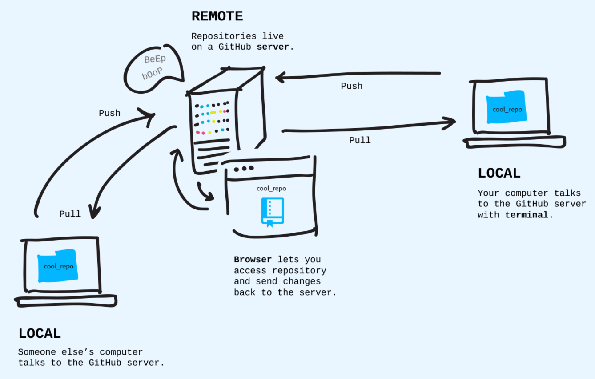

# Code Camp 2021


# Initial steps (configuration)

```bash
# ver la version
git --version
# configurar tu usuario para que cada que hagas un commit quede rastreado tu nombre y correo
git config --global user.name "Nombre"

git config --global user.email "tuemail@example.com"

```

---

# Crear un repositorio

> sabias que a diferencia de otros VCS git puede ser usado offline ❓

```bash
# crear un folder 'hola-mundo/'
mkdir hola-mundo
# movernos dentro del folder
cd hola-mundo
# inicializar git
git init
```

> 💡 Listo! eso es todo

---
# Commit

```bash
# crear archivo
touch file.txt
# comienza el flujo de trabajo en git

git status

git add file.txt

git commit -m "cree mi primer archivo"
```

> sabrias explicar que sucedio ❓


## Mas cambios

```bash
# agreguemos lineas al archivo

echo "mi primer linea" >> file.txt

# comparemos

git diff

# mismos comandos previos


# revisa el historial

git log

```


> comandos aprendidos hasta el momento
> - git status
> - git diff
> - git add <ARCHIVO>
> - git add .
> - git commit -m "tu mensaje"


---

# Remotos

crea tu cuenta en [github.com](github.com) o [gitlab.com](gitlab.com)

```bash
# actualiza tu usuario para que cada que hagas un commit quede rastreado tu nombre y correo
git config --global user.name "username"

git config --global user.email "tuemail@example.com"

```





```bash
# agregar la URL remota
git remote add origin <URLDEGITHUB>

# o cambiar si ya existia una
git remote set-url origin <URLDEGITHUB>

# chequear el remoto
git remote -v

# hagamos push de nuestros cambios locales al remoto

git push origin main
```

> 💡 la palabra 'origin' es un alias al remoto, para poder distinguir entre multiples remotos


# Branches


```bash
# crear branch

git branch  <BRANCH>

# cambiar a ese branch
git checkout <BRANCH>


# creemos un nuevo archivo

touch my-file-in-a-branch.txt
```
---
# Pull Requests

